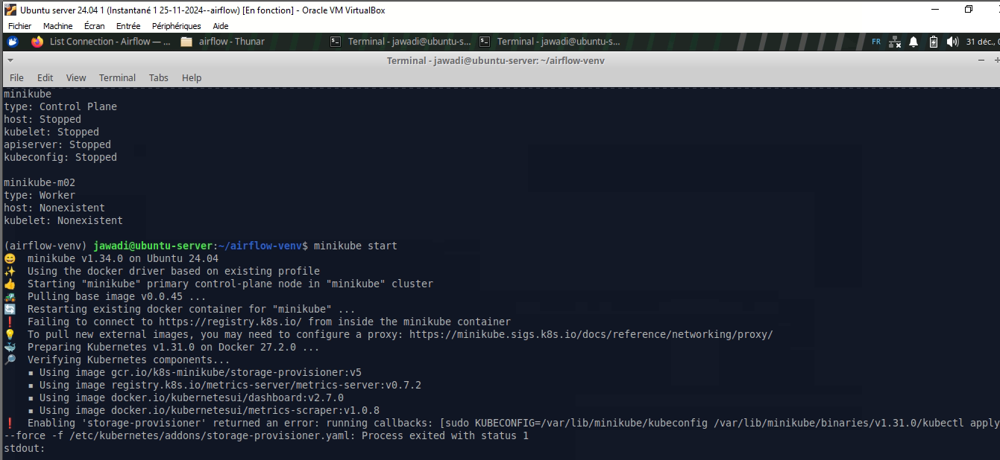
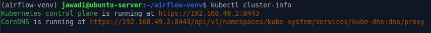
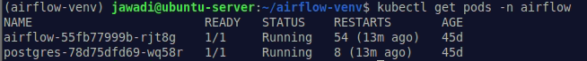
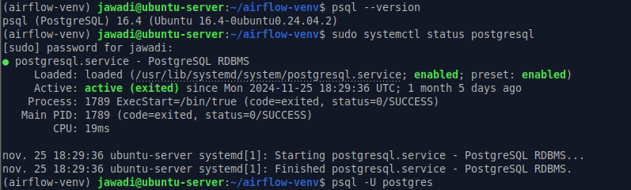
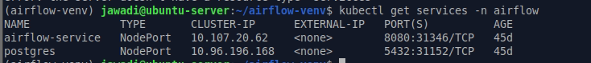
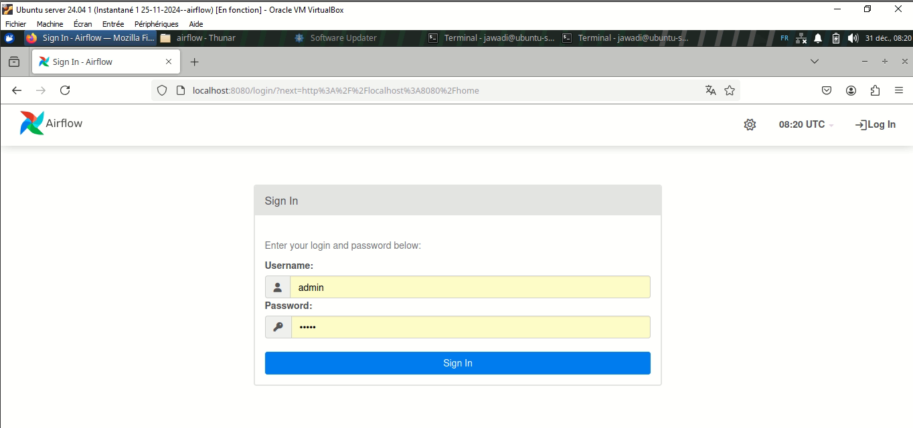
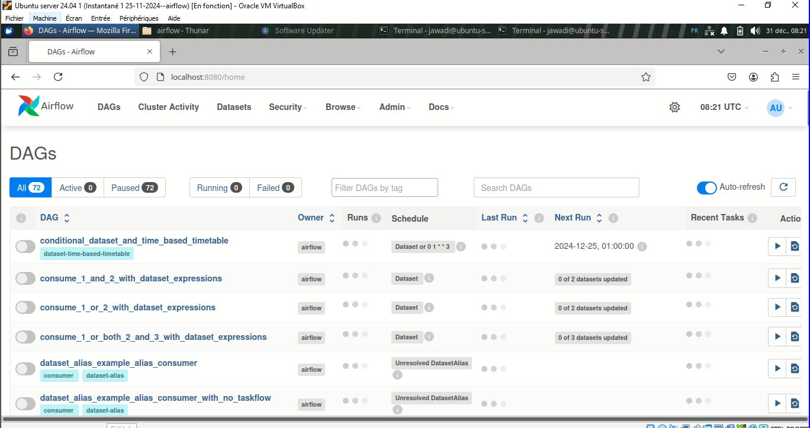
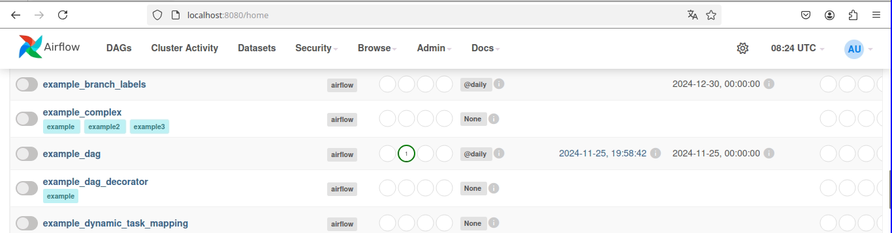
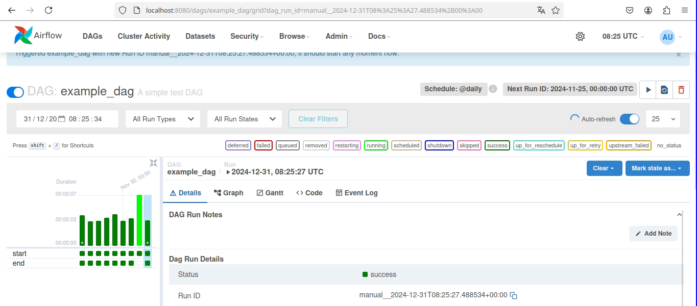

**Installation airflow/postgres et démarrage du cluster**

-   **Étape 1** : Installer Minikube

    -   Téléchargez Minikube depuis le site officiel et installez-le.

> https://minikube.sigs.k8s.io/docs/

-   **Étape 2** : Démarrer Minikube

    -   Commande : minikube start

{width="6.4895877077865265in"
height="3.133853893263342in"}

**2. Installation de kubectl**

{width="6.3in"
height="0.4923261154855643in"}

{width="6.3in"
height="0.667587489063867in"}

**3. Création des fichiers de déploiement pour PostgreSQL**

{width="6.3in"
height="1.8997987751531058in"}

**4. Configuration des services**

{width="6.3in"
height="0.6811122047244095in"}

**5. Accéder à Airflow**

{width="6.3in"
height="2.95709864391951in"}

**Page d'accueil :**

{width="6.3in"
height="3.3324956255468066in"}

**DAGs : Exemple**

{width="6.3in"
height="1.6557261592300963in"}

**8. Suivi et gestion des logs**

{width="6.3in"
height="2.770424321959755in"}
